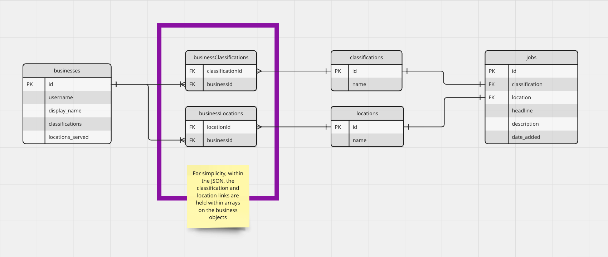

**API & Web Challenge**

The project uses the following technologies:

- Node
- Express
- Vue3
- Jest

https://github.com/anshulkthr/assessment-yell/assets/9865547/f7594e63-a90b-4552-8696-e6d857eafc07

# Yell's Front-End Engineering Coding Challenge
## Welcome
The goal of this coding challenge is to give you, the candidate, an idea of the kind of tasks you may be working on, and to give us an idea of what level your skills are at, as well as, more importantly, the way in which you approach solving problems.

We understand that time is a precious resource, so, we ask that you spend no more than 3 hours on this task. We know that it might not be long enough to develop a fully fledged solution, but if you don't finish a feature, please annotate what you would have done, given more time, and we will discuss this in the follow-up interview.

### Who we are
We're a multidisciplinary team who work together to connect our visitors with businesses in their area, to meet their needs, utilising a current stack of Vue 2 & ExpressJS on the front-end.

## Overview of the task
Using the sample data provided in `./sample_data/`, create a small application which fetches data from a Node.js endpoint and displays it to the user if it is relevant to them.

### Further context
One of our offerings is our Yell Marketplace, where [yell.com](https://yell.com) visitors can post an enquiry to a relevant classification and location combination, which results in their enquiry being sent to relevant businesses via app notifications. As well as via their app notifications, businesses with the relevant service package may also access these enquiries via search. In the business context, these enquiries are referred to as '**jobs**'. We would like you to develop a small application which allows users to select their username (no need to worry about authentication here) and from that, be shown the relevant jobs, displayed in a list which showcases the jobs' classification name, location name, headline, description, and date added (in human-readable format).

## What we're looking for
We'll mostly be looking for evidence of your ability to:

1. Understand the task at hand
2. Prioritise tasks for a minimum viable product
3. Build components using a modern framework (preferably Vue 2 or Vue 3 components)
4. Write clear, concise JavaScript code with sensible naming conventions
5. Write unit and component tests
6. Create endpoints using Node.js (feel free to use a framework like Nuxt)
7. Handle errors, edge cases, and exceptions

## Sample data entity relationship diagram

## Submitting your solution
Please create a GitHub repository for your solution, then push your changes there, complete with a `README` explaining what you've done, and then send us a link to it.

## In the follow-up interview
Following receipt of your submission, we will meet again to discuss the approach you took to creating your solution; what you might have done differently given more time; and perform some pair programming on enhancements for a feature of your choice (such as one that you didn't manage to complete due to original time constraints).
